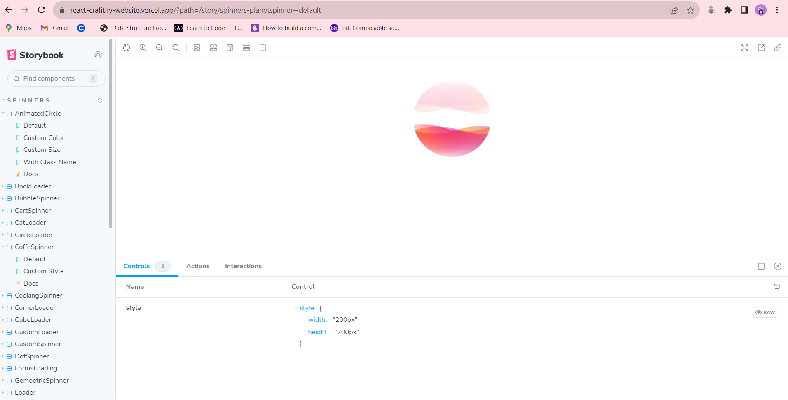
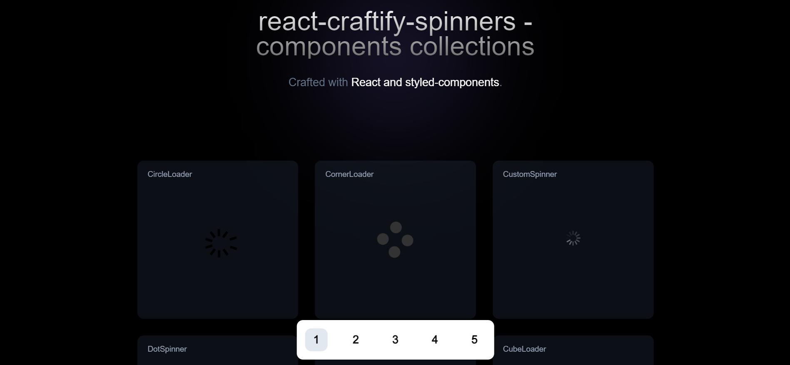

<div align="center">
  
</div>

<h1 align="center">react-craftify-spinners</h1>

<div align="center">
  <p>The react-craftify-spinners package provides a collection of customizable and visually appealing spinner components for React applications. These spinners can be used to indicate loading or processing states in various parts of your application.</p>
</div>

<div align="center">
  <a href="https://www.npmjs.com/package/react-craftify-spinners">
    
  </a>
</div>

## 📚 Documentation and Storybook

- Check out the Storybook documentation [here](https://react-crafitify-website.vercel.app/)

| Screenshot 1 | Screenshot 2 | Screenshot 3 | Screenshot 4 |
|--------------|--------------|--------------|--------------|
|  |  |  |  |


## ✨ Features

- 🌀 Beautifully designed spinner components
- 🎨 Easily customizable with CSS classes
- ⚙️ Flexible configuration options
- 📦 Lightweight and dependency-free
- 🛡 Written entirely in TypeScript with predictable static types.
- ⚙️ A full suite of design resources and tools to facilitate development.

## Author

Author: Donia Skima 😊

## 📦 Install

```bash
npm install react-craftify-spinners
```

```bash
yarn add react-craftify-spinners
```

## 🔨 Usage


## Available Spinner Components

This library provides a variety of spinner components that you can easily integrate into your React projects. Here's a list of the available spinner components:

- `CoffeSpinner`
- `SmileSpinner`
- `ScanSpinner`
- `CartSpinner`
- `GemoetricSpinner`
- `CookingSpinner`
- `BubbleSpinner`
- `CircleLoader`
- `PlanetSpinner`
- `CornerLoader`
- `CubeLoader`
- `CustomLoader`
- `CustomSpinner`
- `DotSpinner`
- `LoadingBar`
- `NewtonsCradle`
- `RotatingCircleBorderLoader`
- `RotatingCirclesLoader`

2. Import the spinner components you want to use in your React component file:

```bash
import React from 'react';
import {
  BubbleSpinner,
  CookingSpinner,
  AnimatedCircle,
  CartSpinner,
  CoffeSpinner,
  GemoetricSpinner,
  PlanetSpinner,
  SmileSpinner,
  ScanSpinner,
  Loader,
  CircleLoader,
  CornerLoader,
  CubeLoader,
  CustomLoader,
  CustomSpinner,
  DotSpinner,
  LoadingBar,
  NewtonsCradle,
  RotatingCircleBorderLoader,
  RotatingCirclesLoader,
  // Import more spinner components here
} from 'react-craftify-spinners';

const MyComponent = () => {
  return (
    <div>
      {/* Example usage of different spinner components */}

      {/* Coffe loader */}
      <CoffeSpinner />


      {/* Standard circle loader */}
      <CircleLoader />

      {/* Corner loader */}
      <CornerLoader />

      {/* Cube loader */}
      <CubeLoader />

      {/* Custom loader with customizable properties */}
      <CustomLoader />

      {/* Custom spinner with user-defined animation */}
      <CustomSpinner />

      {/* Simple dot spinner */}
      <DotSpinner />

      {/* Loading bar indicating progress */}
      <LoadingBar />

      {/* Newtons cradle animation */}
      <NewtonsCradle />

      {/* Circle loader with rotating border */}
      <RotatingCircleBorderLoader />

      {/* Multiple rotating circles */}
      <RotatingCirclesLoader />

      {/* Add more spinner components here */}
      {/* Remember to provide relevant descriptions for any additional spinners */}

      {/* End of spinner components */}
    </div>
  );
};

export default MyComponent;


```

## ⌨️ Development

### Node version

First of all let's use version 16 of node so we don't have compatibility problems, for this we can use [nvm](https://github.com/nvm-sh/nvm#installing-and-updating) just run in the repository folder the command:

```bash
$ nvm use
```

This command will look for the .nvmrc file and will find the version with which the project was created.

---

### Development environment

Use Gitpod, a free online dev environment for GitHub.

[](https://github.com/doniaskima/react-crafitify)

Or clone locally:

```bash
$ git clone https://github.com/doniaskima/react-crafitify
$ cd react-crafitify
$ npm install

```

Open your browser and visit http://127.0.0.1:3000

## Prerequisites 🛠️

Before you begin, ensure you have met the following requirements:

Make sure you have:

- Nodejs
- npm or yarn
- git

## Let's Contribute 👍

- Step 1 - Fork this repository.
- Step 2 - Clone the repository to your local machine.
- Step 3 - Resolve the bugs, mentions provided in the Issues section of the repository. Also add a description of what changes you have done.
- Step 4 - Add the changes to your repository.
- Step 5 - Create a PULL Request. And that's all.

## What you can contribute in this repo? 👊

- You can add your own competitive programming solutions.
- There are various topics like Functionality, Modal aspect of react-crafitify etc. You can contribute in them
- You can contribute some Learning Resources in the READme.md File.
- You can modify previous solutions if you feel like your solution has better Time or Space complexity.

[](http://makeapullrequest.com)

## Keywords 🤌

TypeScript javascript Library ReactJS Components Microsoft compiler language UI React-ui framework
frontend Design library-ui
